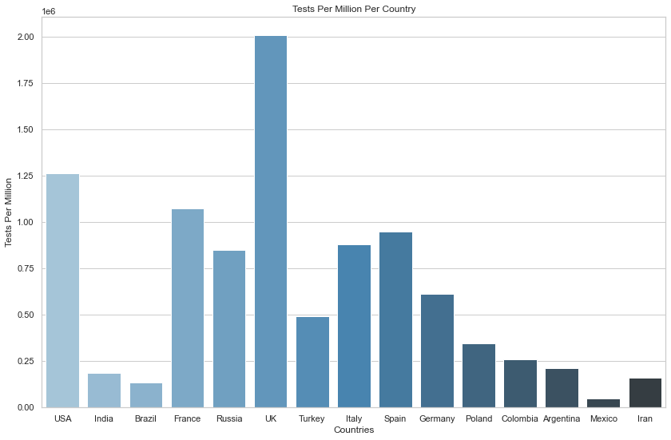

# Worldometer-Global-COVID-Cases
* Scraped [Worldometer](https://www.worldometers.info/coronavirus/) using BeautifulSoup to get global COVID-19 data
* Cleaned data
* Displayed Cases, Tests, Deaths per 1M for several countries

### Cases/Million Per Country

### Deaths/Million Per Country

### Tests/Million Per Country

Future Update: Automate Job and stream to dashboard
